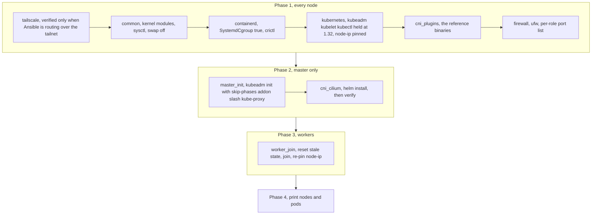

# K8sSecDaP-infra

Ansible that turns a set of freshly installed Ubuntu 24.04 machines into the bare-metal
Kubernetes cluster [K8sSecDaP](https://github.com/john-naeder/K8sSecDaP) runs on. Everything
above the cluster — Argo CD, GitLab, the SOC services — belongs to other repos; this one stops
the moment `kubectl get nodes` returns Ready.

The interesting part is not that it runs `kubeadm init`. It is the networking decision:
**Cilium in native routing mode with `kubeProxyReplacement`, on the LAN, with no overlay and
no kube-proxy at all.** That choice constrains the rest of the design, and most of the
assertions in the Cilium role exist to fail loudly when a precondition for it stops holding.

## What a run does



CoreDNS is Pending between phase 2's two roles. That is correct, not a fault: without
kube-proxy and without a CNI there is nothing to give it an address.

## The networking decision, and its preconditions

`routingMode: native` with `autoDirectNodeRoutes: true` means a pod packet goes onto the wire
as itself. No VXLAN header, no encapsulation CPU, and `tcpdump` and Hubble see real pod IPs
instead of a tunnel you have to unwrap — which matters a lot when the point of the project is
inspecting pod-to-pod traffic. Cilium installs a route to each other node's podCIDR via that
node's IP, and the LAN does the rest.

It only works if every node is on the same layer-2 subnet, so `roles/cni_cilium/tasks/main.yml`
asserts exactly that before touching Helm:

- kernel is 5.10 or newer, which `kubeProxyReplacement` requires
- every node's `node_ip` falls inside `lan_cidr`
- `lan_cidr` really is a `/24`, because the check above compares three octets and would
  silently pass otherwise
- the declared `node_ip` is actually present on the machine

Getting this wrong does not produce an error. It produces pods that can reach pods on their
own node and cannot reach pods on any other, with nothing in any log to explain it. An
assertion that fails in ten seconds is worth a lot against a symptom like that.

After the install, two more assertions read `cilium-dbg status` and fail unless it reports
`KubeProxyReplacement: True` and `Routing: Network: Native`. A Helm values file that silently
did not apply is otherwise indistinguishable from one that did.

**Removing kube-proxy is not optional here.** `master_init` passes
`--skip-phases=addon/kube-proxy`, and `cni_cilium` deletes the DaemonSet and ConfigMap anyway
in case the cluster predates that. If both are running, kube-proxy's iptables rules and
Cilium's eBPF both program NAT for the same Service and which one wins depends on load order.

**With no kube-proxy, Cilium cannot bootstrap through `kubernetes.default.svc`** — that
ClusterIP is the thing it is responsible for creating. `k8sServiceHost` therefore points at
the master's real IP, which makes that address permanent: changing it later means regenerating
the API server certificate and reinstalling Cilium.

**Pod MTU is 1280, not 1500.** Cilium auto-detects devices and takes the smallest MTU among
them, and `tailscale0` at 1280 is in that set. The values template deliberately does not
declare an MTU. Forcing 1500 while a 1280-byte path is still in the device list gives you
pod traffic that completes a TCP handshake and then hangs on the first large packet. The
trade-off is stated in `group_vars/all/versions.yml`: keeping `tailscale0` means NodePort
services are reachable from the tailnet, at the cost of 220 bytes of MTU.

## Layout

```
ansible/inventory/          static hosts.yml plus per-host lan_ip and tailscale_ip
ansible/inventory/group_vars/all/
    network.yml             lan_cidr, pod_cidr, service_cidr, firewall port lists,
                            kubelet reservations
    versions.yml            every pinned version, with the reasoning next to it
ansible/roles/              common, containerd, kubernetes, cni_plugins, firewall,
                            tailscale, master_init, cni_cilium, worker_join
ansible/playbooks/          site.yml (all four phases), master.yml, worker.yml, reset.yml
bootstrap/                  register-node.sh and sync-inventory.sh, from the era when node
                            identity came from Tailscale
docs/runbook-worker-2.md    the recovery notes for a node that is currently offline
```

Each host declares two addresses and they mean different things. `lan_ip` is the node's
identity in the cluster; it is what `--node-ip` and every Cilium route use. `tailscale_ip` is
an administrative path only. `ansible_transport_net` selects which one Ansible connects over,
and changing it does not change cluster identity:

```bash
ansible-playbook playbooks/site.yml                                    # from the same LAN
ansible-playbook playbooks/site.yml -e ansible_transport_net=tailscale # from elsewhere
```

## Run it

```bash
cd ansible
make ping        # ansible all -m ping
make check       # --check --diff, a dry run
make setup       # all four phases
make master      # control plane only
make worker      # workers only; NODE=<host> to limit to one
make reset       # kubeadm reset everywhere
```

`.vault_password`, `bootstrap.env` and `nodes.env` are gitignored. Vault is currently unused —
the `vault-*` Make targets exist but nothing reads an encrypted var file.

## Deliberate small decisions

**`kubelet` reservations are a fudge factor, and say so.** kubeadm's static pods — etcd,
apiserver, controller-manager, scheduler — declare CPU requests but no memory requests, so the
scheduler believes they cost nothing while they use around 1.5 GB. `system_reserved` in
`network.yml` is inflated to cover that, with the arithmetic written out so the next reader
does not conclude the OS needs 3 GB.

**The master is schedulable.** With two usable nodes, refusing to place workloads on the
control plane leaves one node.

**Firewall rules track the CNI choice.** There is no VXLAN port 8472 because there is no
encapsulation, and no 10256 because there is no kube-proxy healthz. Port 4240 is open for
Cilium's health checks.

**Hubble is enabled in the agent, relay and UI are not.** In-agent flow visibility is close to
free and, under native routing, shows real pod IPs. Relay and UI cost roughly 300 MB, which
this cluster does not have.

## Limits

- **Two nodes, one of them the master.** A worker has been offline since 2026-08-18 and is
  commented out of the inventory; `docs/runbook-worker-2.md` has the recovery steps.
- **Single control plane, no HA.** `--upload-certs` is passed but no second master is joined.
  Losing the master loses the cluster.
- **The `/24` assertion is load-bearing and crude.** Comparing the first three octets is only
  correct for a `/24`, which is why a separate assertion refuses anything else. A different
  subnet size means rewriting the check.
- **`bootstrap/sync-inventory.sh` is stale.** It generated inventory from Tailscale addresses;
  node identity moved to LAN addressing and the inventory is now maintained by hand. `make sync`
  still calls it.
- **The nodes are laptops on Wi-Fi.** Interface names differ between them, which is why
  `cilium_devices` is left to auto-detection, and it is also why one node dropped off the
  network without a hardware fault.
- **`ansible/README.md` predates the Cilium migration** and still describes Calico and a
  Tailscale-addressed cluster. The roles are the source of truth.
